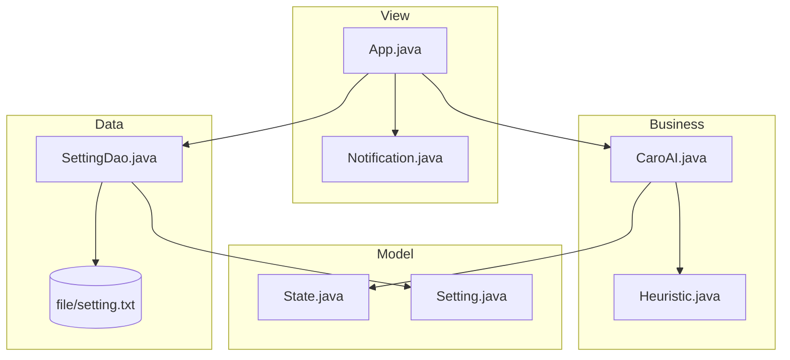

# Caro Game

Ứng dụng desktop chơi **Cờ Caro (Gomoku)** với AI, xây dựng bằng **Java Swing**. Dự án thể hiện kỹ năng lập trình hướng đối tượng, thiết kế giao diện desktop và triển khai thuật toán tìm kiếm trong trí tuệ nhân tạo.

---

## Tổng Quan

**Caro Game** là ứng dụng cho phép người chơi (X) đấu với AI (O) trên bàn cờ 19×19. AI sử dụng thuật toán **Alpha-Beta Pruning** kết hợp **Heuristic Evaluation** để chọn nước đi tối ưu, cân bằng giữa tấn công và phòng thủ.

| Thông Tin | Chi Tiết |
|-----------|----------|
| **Ngôn Ngữ** | Java |
| **Giao Diện** | Java Swing (Desktop) |
| **Thuật Toán AI** | Alpha-Beta Pruning + Heuristic |
| **Phụ Thuộc** | Không (chỉ cần JDK) |
| **Nền Tảng** | Windows / macOS / Linux |

---

## Tính Năng

- Bàn cờ **19×19**, thắng khi tạo **5 quân liên tiếp** (ngang, dọc, chéo)
- AI tự động phân tích và đánh sau lượt người chơi
- Hai chế độ: **Người đánh trước** hoặc **AI đánh trước**
- Bảng điểm theo dõi số trận thắng/thua
- Tùy chỉnh màu sắc: nền, ô vuông, màu X, màu O
- Lưu cấu hình tự động vào file `file/setting.txt`
- Nút **Info** và **Introduce** mở popup giới thiệu dự án và luật chơi

---

## Cách Chơi

1. **Click 1 lần** vào ô để xem trước (highlight)
2. **Double-click** vào ô trống để đánh quân **X**
3. AI sẽ tự động đánh quân **O**
4. Thắng khi tạo được 5 quân liên tiếp; hòa khi bàn cờ đầy

---

## Kiến Trúc Dự Án

Dự án được tổ chức theo mô hình phân lớp (Layered Architecture):

```
src/caro/
├── view/       # Giao diện Swing (App, Notification)
├── bo/         # Business logic & AI engine (CaroAI, Heuristic)
├── bean/       # Model dữ liệu (State, Cell, Setting, ...)
├── dao/        # Lưu/đọc cấu hình (SettingDao)
└── values/     # Hằng số & thông điệp (Value)
```



---

## Thuật Toán AI

### 1. Alpha-Beta Pruning

AI sử dụng thuật toán **Minimax** với **Alpha-Beta Pruning** để cắt tỉa các nhánh tìm kiếm không cần thiết, giảm độ phức tạp so với duyệt đầy đủ.

- **Độ sâu tìm kiếm:** 3 lớp (`MAX_DEPTH = 3`)
- **Nhánh tối đa mỗi cấp:** 8 nước đi (`MAX_NUM_OF_HIGHEST_CELL_LIST = 8`)
- AI (Max) tối đa hóa điểm; Người chơi (Min) tối thiểu hóa điểm

### 2. Heuristic Evaluation

Hàm đánh giá tính điểm dựa trên các **mẫu quân** (pattern) trên bàn cờ:

| Loại Mẫu | Ví Dụ | Trọng Số |
|----------|-------|----------|
| 2 quân mở | `00110` | 4 |
| 3 quân | `01110` | 8 |
| 4 quân (sắp thắng) | `01111` | 1000 |
| 5 quân (thắng) | `11111` | 100000 |

- Quét theo **4 hướng**: ngang, dọc, chéo chính, chéo phụ
- Mỗi ô trống được chấm điểm **tấn công** và **phòng thủ**
- Điểm ô bị nhân đôi khi có **4 quân liên tiếp** (mối đe dọa thắng)

### 3. Luồng Chọn Nước Đi

```
1. Đánh giá điểm từng ô trống trên bàn cờ hiện tại
2. Lọc ra top 8 ô có điểm cao nhất
3. Với mỗi ô candidate, chạy Alpha-Beta để dự đoán
4. Chọn ngẫu nhiên trong các nước đi có điểm tốt nhất (tránh lặp lại)
```

---

## Yêu Cầu Hệ Thống

- **JDK 17** trở lên (khuyến nghị JDK 17 hoặc 21)
- Không cần cài thêm thư viện bên ngoài

Kiểm tra Java đã cài:

```bash
java -version
javac -version
```

---

## Cách Chạy Dự Án

### Cách 1: Script (Windows — khuyến nghị)

```bash
scripts\build.bat
scripts\run.bat
```

### Cách 2: Command Line

```bash
mkdir -p out/production/carogame

javac -encoding UTF-8 -d out/production/carogame \
  src/caro/bean/*.java \
  src/caro/bo/*.java \
  src/caro/dao/*.java \
  src/caro/values/*.java \
  src/caro/view/*.java

java -cp out/production/carogame caro.view.App
```

> **Lưu ý:** Chạy từ thư mục gốc project để ứng dụng đọc được `file/setting.txt` và `file/img/icon.png`.

### Cách 3: IntelliJ IDEA

1. Mở IntelliJ IDEA → **Open** → chọn thư mục `Caro-Game`
2. Đặt `src` làm **Sources Root**
3. Tạo Run Configuration:
   - **Main class:** `caro.view.App`
   - **Working directory:** thư mục gốc `Caro-Game`
4. Nhấn **Run**

### Test AI (Không GUI)

```bash
java -cp out/production/carogame caro.bo.TestAI
```

Chạy 5 lượt random giữa người chơi và AI, in kết quả ra console.

---

## Cấu Trúc Thư Mục

```
Caro-Game/
├── README.md                 # Tài liệu dự án
├── LICENSE                   # Giấy phép MIT
├── .gitignore
├── file/
│   ├── setting.txt           # Cấu hình mặc định
│   └── img/
│       └── icon.png          # Icon ứng dụng
├── scripts/
│   ├── build.bat             # Script biên dịch (Windows)
│   └── run.bat               # Script chạy game (Windows)
└── src/caro/
    ├── bean/                 # Model
    ├── bo/                   # AI & logic game
    ├── dao/                  # File I/O
    ├── values/               # Hằng số
    └── view/                 # Giao diện
```

---

## Cấu Hình

File `file/setting.txt` (5 dòng):

```
<R>,<G>,<B>    # Màu nền
<R>,<G>,<B>    # Màu ô vuông
<R>,<G>,<B>    # Màu chữ X
<R>,<G>,<B>    # Màu chữ O
<mode>         # 0 = người trước, 1 = AI trước
```

Thay đổi màu sắc hoặc chế độ chơi trong game sẽ tự động lưu vào file này.

Các tham số AI có thể điều chỉnh trong `src/caro/values/Value.java`:

| Tham Số | Mặc Định | Mô Tả |
|---------|----------|-------|
| `SIZE` | 19 | Kích thước bàn cờ |
| `MAX_DEPTH` | 3 | Độ sâu Alpha-Beta |
| `MAX_NUM_OF_HIGHEST_CELL_LIST` | 8 | Số nước đi candidate mỗi cấp |

---

## Kỹ Năng Thể Hiện Qua Dự Án

- **OOP & Design Patterns:** Phân lớp View / Business / Data Access
- **Swing GUI:** Event handling, custom border, color picker
- **AI / Search Algorithms:** Alpha-Beta pruning, heuristic design
- **File I/O:** Lưu/đọc cấu hình UTF-8
- **Clean Code:** Tách module rõ ràng, dễ bảo trì và mở rộng

---

## Hướng Phát Triển

- [ ] Thêm chế độ chơi 2 người (PvP)
- [ ] Hỗ trợ undo/redo nước đi
- [ ] Tăng độ sâu tìm kiếm hoặc dùng iterative deepening
- [ ] Đóng gói thành file `.jar` để phân phối
- [ ] Thêm unit test cho logic thắng/thua và heuristic

---

## Giấy Phép

Dự án phát hành dưới giấy phép [MIT](LICENSE).
